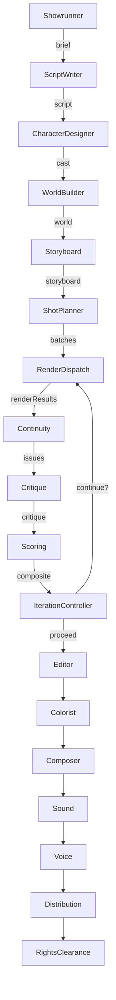

<p align="center">
  <h1 align="center">cinestudio</h1>
  <p align="center">Multi-agent AI film rendering platform — 30-second spots to 20-minute shorts, orchestrated by a Strands Graph with a parallel render Workflow.</p>
  <p align="center">
    <a href="https://nodejs.org/"></a>
    <a href="https://nextjs.org/"></a>
    <a href="https://github.com/strands-agents/harness-sdk"></a>
    <a href="LICENSE"></a>
  </p>
</p>

**cinestudio** is a production-grade, multi-agent film rendering web app. You give it a
logline or treatment; 17 specialized agents coordinate through a deterministic Graph
plus a parallel render Workflow to produce a 30-second-to-20-minute film — script,
characters, world, storyboard, rendered shots, score, sound design, color, voice, and
distribution package included.

The architecture is a direct port of the Strands multi-agent patterns
([docs](https://strandsagents.com/docs/user-guide/concepts/multi-agent/multi-agent-patterns/)):
**Graph** for the spine, a custom **Workflow Node** for parallel shot rendering, and
**conditional edges** that route between iterate / proceed based on the composite
quality score.

---

## Features

- **17 specialized agents** coordinated by a Strands Graph — Showrunner, Script Writer,
  Character Designer, World Builder, Storyboard, Shot Planner, Render Dispatcher,
  Continuity Checker, Critic, Iteration Controller, Scorer, Editor, Colorist, Composer,
  Sound Designer, Voice Casting, Rights Clearance, Distribution
- **Parallel render Workflow** — shots are pre-batched by style tag and fanned out
  concurrently across **Veo 3.1**, **Sora**, and **Runway** at per-provider
  concurrency limits
- **Multi-provider text LLM** — Amazon Bedrock (default), Anthropic, OpenAI,
  Google Gemini, Ollama, or MiniMax. Configured through the onboarding screen
- **Surgical iteration** — the Critic scores each shot across 10 dimensions; only
  failing shots are re-rendered, preserving GO shots verbatim
- **Live SSE updates** — the run detail page subscribes to a server-sent-event stream
  and renders a per-agent timeline, event log, and JSON output inspector
- **Quantified quality enforcement** — composite quality report drives GO / NO-GO /
  CONDITIONAL decisions
- **Cinestudio brief → Script → Storyboard → Render → Score → Compose → Distribute** —
  full pipeline from idea to YouTube / Vimeo / festival export presets
- **PLD-ready outputs** — distribution package with container/codec/resolution/aspect
  specs, caption tracks, festival applications

---

## Quick Start

```bash
git clone https://github.com/your-org/cinestudio.git
cd cinestudio
pnpm install
pnpm db:migrate
pnpm dev
```

Visit `http://localhost:3000` — the onboarding screen will ask you to choose a text
provider. After saving, you land on the dashboard and can start a film.

### Prerequisites

- **Node 26+** (see `package.json` — `engines.node >= 26.0.0`)
- **pnpm 9+**
- A **model provider** with API access (Bedrock, Anthropic, OpenAI, Gemini, Ollama,
  or MiniMax)
- A **render provider** if you want video output (Veo 3.1, Sora, or Runway). If you
  have none, the platform still produces the brief / script / storyboard / color /
  audio plan and you can render shots manually later.

---

## Architecture



| # | Agent | Pattern Role | Output |
|--:|-------|--------------|--------|
| 0 | Showrunner | Graph entry | CinestudioBrief |
| 1 | ScriptWriter | Graph | ScriptBreakdown |
| 2 | CharacterDesigner | Graph | CharacterCast |
| 3 | WorldBuilder | Graph | WorldDesign |
| 4 | Storyboard | Graph | Storyboard (with render batches) |
| 5 | ShotPlanner | Graph | RenderBatchPlan[] |
| 6 | RenderDispatcher | **Custom Node** (parallel Workflow) | ShotRenderResult[] |
| 7 | ContinuityChecker | Graph | ContinuityIssue[] |
| 8 | Critic | Graph | CritiqueReport (10 dimensions) |
| 9 | IterationController | Graph (cycle) | IterationControlReport |
| 10 | Scorer | Graph | CompositeQualityReport |
| 11 | Editor | Graph | AssemblyPlan |
| 12 | Colorist | Graph | ColorGradeDirection |
| 13 | Composer | Graph | ScorePlan |
| 14 | SoundDesigner | Graph | SoundDesignPlan |
| 15 | VoiceCasting | Graph | VoiceCast |
| 16 | Distribution | Graph | DistributionPackage |
| 17 | RightsClearance | Graph (terminal) | RightsReport |

The **iteration cycle** (`Scoring -> IterationController -> RenderDispatcher`) is
bounded by `defaults.maxIterations` and the composite's `recommendation`. When the
Critic + Scorer decide all shots are GO, the cycle breaks and execution flows into
the Editor -> Colorist -> ... -> RightsClearance spine.

See [docs/ARCHITECTURE.md](docs/ARCHITECTURE.md) for the deep dive.

---

## Configuration

| Setting | Default | Description |
|---------|---------|-------------|
| `textProvider.provider` | `bedrock` | One of: bedrock / anthropic / openai / google / ollama / minimax |
| `textProvider.model` | `global.anthropic.claude-sonnet-4-6` | Model identifier |
| `renderProviders.veo.enabled` | `true` | Toggle Veo 3.1 |
| `renderProviders.sora.enabled` | `false` | Toggle OpenAI Sora |
| `renderProviders.runway.enabled` | `false` | Toggle Runway Gen-3 |
| `defaults.maxIterations` | `3` | Critic iteration cycles |
| `defaults.qualityThreshold` | `70` | Composite GO threshold |
| `defaults.aspectRatio` | `16:9` | Default aspect for new runs |
| `defaults.targetRuntimeSeconds` | `{min:30,max:120}` | Runtime budget per film |

All configuration is editable from the onboarding screen and persisted to a local
SQLite DB (`./data/cinestudio.db`).

---

## Development

```bash
pnpm install
pnpm dev          # http://localhost:3000
pnpm typecheck    # tsc --noEmit
pnpm lint         # next lint
pnpm test         # vitest run
pnpm db:migrate   # apply schema to ./data/cinestudio.db
pnpm db:reset     # wipe + re-apply
```

### Project Structure

```
cinestudio/
├── app/                       # Next.js 16 App Router
│   ├── (onboarding)/          # First-run provider setup
│   ├── (dashboard)/           # Authenticated app shell
│   │   ├── dashboard/         # Home (recent runs), New film, Run detail
│   │   └── ...
│   ├── api/                   # Route handlers (config, runs, SSE)
│   ├── globals.css
│   ├── layout.tsx
│   └── page.tsx               # Routes to onboarding/dashboard
├── components/
│   ├── ui/                    # shadcn primitives
│   ├── run-live-view.tsx      # SSE-driven run page
│   └── theme-provider.tsx
├── lib/                       # Cross-cutting utilities (cn(), formatters)
├── src/                       # Server-only domain code
│   ├── agents/                # 17 specialized agents
│   ├── db/                    # SQLite (better-sqlite3) + migrations
│   ├── graph/                 # Strands Graph + seed plugin
│   ├── lib/                   # logger, id, json, promise, errors, artifacts
│   ├── models/                # Zod schemas
│   ├── orchestrator/          # Run pipeline driver
│   ├── prompts/               # System prompts
│   ├── providers/             # Model provider factory
│   ├── stream/                # In-memory event bus + SSE sinks
│   ├── types/                 # CinestudioConfig
│   └── workflow/              # Render dispatch + agent-node factory
├── tests/                     # Vitest specs
├── public/
├── package.json
├── tsconfig.json
├── next.config.ts
├── tailwind.config.ts
├── components.json            # shadcn config
├── vitest.config.ts
└── .env.example
```

### Adding a New Provider

1. Add the type to `src/types/index.ts` (`TextProviderConfig.provider` enum).
2. Add a build case to `src/providers/factory.ts`.
3. (Optional) Add a default model preset to `app/(onboarding)/onboarding/setup/page.tsx`.

### Replacing the Stub Render Tool

`src/agents/render-dispatcher.ts` carries a stub `render_*` tool that throws. Wire in
real provider calls (e.g. `@google/genai` for Veo, the OpenAI Sora API, the Runway
HTTP client) inside `callback:` of each `tool({...})` call.

---

## License

[MIT](LICENSE)
